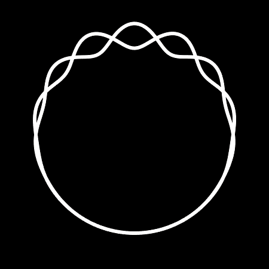
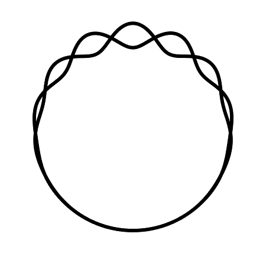
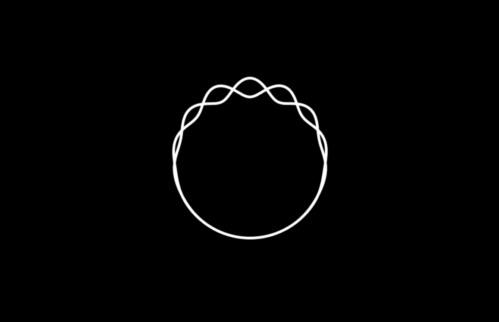
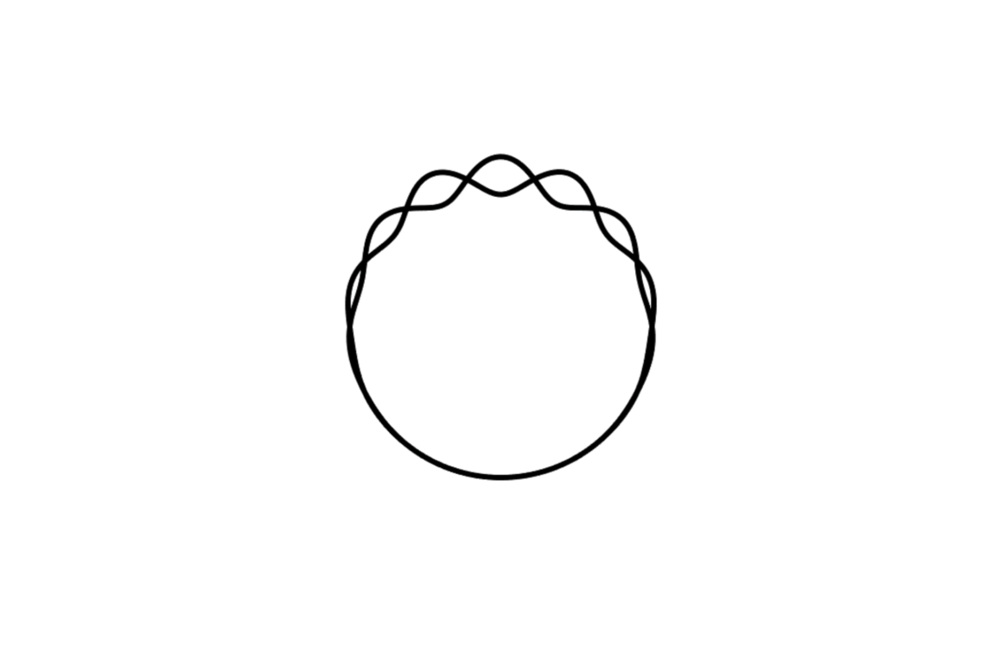

# Weaving Helix Ring Splashscreen
A splashscreen based of a weaving helix circle looping animation. The splashscreen is a simple looping 450x450px gif centered in the screen with a solid background.

There is a **dark and light** (inverted dark) version. There is also a currently unnused transparent version in the main Preview folder.

| Dark Version | Light Version |
|:----------|:----------|
|    Dark Animation Preview |    Light Animation Preview |
|    Dark Splashscreen Preview |    Light Splashscreen Preview |

This was originally built for KDE Plasma 6, but I am trying to make it fairly universal.

**Project Roadmap**

| Format | Status |
|:----------|:----------|
| KDE Plasma 6 | :white_check_mark: |
| KDE Plasma Generic| :white_check_mark: |
| Plymouth| :x:  |